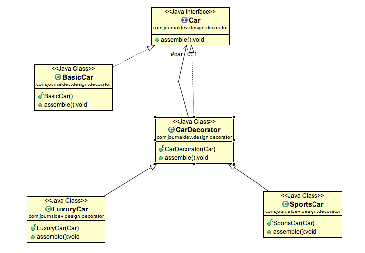

# design patterns strutturali

+ Thinkopen Academy 2018-07-19

Note:
Remember to explain why it's for everyone: no sign-up, nothing to install.
Just MD. Then git-commit.

---

## chi sono

Simone Celia, FullStack Java Developer, lavoro nell'ambito della consulenza informatica da 5 anni, in Thinkopen da 2

---

## dove trovare queste slide

(e relativo codice eseguibile)

[https://github.com/simon387/structural-patterns-presentation](https://github.com/simon387/structural-patterns-presentation)

---

## riferimenti

+ Erich Gamma, Richard Helm, Ralph Johnson, John Vlissides, “Design Patterns: Elements of Reusable Object Oriented Software“.
+ [https://www.docenti.unina.it/webdocenti-be/allegati/materiale-didattico/98381](https://www.docenti.unina.it/webdocenti-be/allegati/materiale-didattico/98381)
+ [https://www.journaldev.com](https://www.journaldev.com)
+ wikipedia
+ stackoverflow

Note:
https://www.journaldev.com/1827/java-design-patterns-example-tutorial

---

# iniziamo!

---

## un po' di storia

+ Introdotti dall'architetto Christopher Alexander. Architetto edile, non software!

> "Ogni pattern descrive un problema che si presenta ferquentemente, e quindi descrive il nucleo della soluzione così che si possa impiegarla milioni di volte, senza produrre due volte la stessa realizzazione"

---

## un po' di storia

+ Il principio è ugualmente valido, anche se riferito ad oggetti, classi ed interfacce piuttosto che ad elementi architettonici come muri, archi, pilastri, ecc... .

---

## un po' di storia (continua)

+ I design patterns hanno raggiunto molta popolarità nel mondo della **computer science** con il libro *Design Patterns: Elements of Reusable Object-Oriented Software* scritto dalla **Gang of Four**

---

## Pattern

individua un'**IDEA**, uno schema **GENERALE E RIUSABILE**

Non è paragonabile ad un componente riusabile perchè:

+ non è un oggetto fisico
+ deve essere contestualizzato all'interno del particolare problema applicativo

---

## Pattern (continua)

due istanze di uno stesso pattern (ad esempio applicate a problemi diversi) tipicamente sono diverse proprio per la contestualizzazione in domini differenti.

---

## Scopo dei Patterns

+ Catturare l'esperienza e la *saggezza* degli esperti
+ Evitare di reinventare ogni volta le stesse cose

---

## Cosa fornisce un design pattern al progettista software?

+ Una soluzione codificata e consolidata per un problema ricorrente
+ Un'astrazione di granualità e livello di astrazione più elevati di una classe

---

## Cosa fornisce un design pattern al progettista software? (continua)

+ Un supporto alla comunicazione delle caratteristiche del progetto
+ Un modo per progettare software con caratteristiche predefinite
+ Un supporto alla progettazione di sistemi complessi

---

## Definizione

Ogni pattern descrive un problema specifico che ricorre più volte e descrive il nucleo della soluzione a quel problema, in modo da poter utilizzare tale soluzione milioni di volte.

---

## Abbastanza astratti

In modo da poter essere condivisi da progettisti con punti di vista diversi e che conoscono tecnologie e linguaggi diversi

---

## né complessi né domain-specific

Non sono rivolti alla specifica applicazione ma riusabili in parti di applicazioni diverse

---

## caratteristiche

Un Design Pattern

+ nomina
+ astrae
+ identifica

gli aspetti chiave di una struttura comune di design che la rendono utile nel contesto del riuso in ambito object-oriented

---

## caratteristiche (continua)

Un Design Pattern identifica:

+ le classi (e le istante) partecipanti
+ le associazioni ed i ruoli
+ le modalità di collaborazione tra le classi coinvolte
+ la distribuzione delle responsabilità nella soluzione del particolare problema di design considerato

---

## tipologie di pattern

Esistono diverse tipologie di pattern, che si differenziano principalmente per la scala ed il livello di astrazione:

1. Architectural Pattern
2. **Design Pattern**
3. Idioms

---

## architectural pattern

+ Utili per strutturare un sistema in sottosistemi

---

## Design Pattern

+ Operano essenzialmente a livello di un singolo sottosistema evidenziando le carattersistiche delle classi coinvolte e delle associazioni tra class

---

## Idioms

+ Utili per l'implementazione di specifici aspetti di design in un particolare linguaggio di programmazione
+ *Common Practice*

---

## come sono fatti i design patterns

+ nome
+ problema
+ soluzione
+ conseguenze

---

## nome

+ il **nome** del pattern, è utile per descrivere la sua funzionalità in una o due parole.

---

## problema

+ il **problema** nel quale il pattern è applicabile. Spiega il problema e il contesto, a volte descrive dei problemi specifici del design mentre a volte può descrivere strutture di classi e oggetti. Può anche includere una lista di condizioni che devono essere soddisfatte precedentemente perchè il pattern possa essere applicato

---

## soluzione

+ la **soluzione** che descrive in modo astratto come il pattern risolve il problema. Descrive gli elementi che compongono il design, le loro responsabilità e le collaborazioni

---

## conseguenze

+ le **conseguenze** portate dall'applicazione del pattern. Spesso sono tralasciate ma sono importanti per poter valutare i costi-benefici dell'utilizzo del pattern.

---

## esempio descrizione DP

+ **Nome e classificazione** del pattern
+ **Sinonimi**: altri nomi del pattern
+ **Scopo**: cosa fa il pattern? a cosa serve?
+ **Motivazione**: scenario che illustra un design problem
+ **Applicabilità**: situazioni in cui si applica il pattern
+ **Struttura**: rappresentazione delle classi in stile OMT
+ **Partecipanti**: classi e oggetti inclusi nel pattern
Note:
OMT = is an object modeling approach for software modeling and designing [link](https://en.wikipedia.org/wiki/Object-modeling_technique)
---

## esempio descrizione DP (continua)

+ **Collaborazioni**: come i partecipanti collaborano
+ **Conseguenze**: come consegue i suoi obiettivi il pattern?
+ **Implementazione**: che tecniche di codifica sono necessarie?
+ **Codice di esempio**: scritto in un linguaggio ad oggetti
+ **Usi noti**: esempi d'applicazione del pattern in sistemi reali
+ **Pattern correlati**: con quali pattern si dovrebbe usare?

---

## categorie di pattern

Esistono diverse categorie di pattern, spesso sono divisi per funzione (purpose) e dominio (scope) del pattern

---

## funzione (purpose), ovvero cosa fa il pattern

+ **Creazionali**: forniscono meccanismi per la creazione di oggetti
+ **Strutturali**: gestiscono la separazione tra interfaccia e implementazione e le modalità di composizione tra oggetti
+ **Comportamentali**: consentono la modifica del comportamento degli oggetti minimizzando la necessità di cambiare il codice

---

## dominio (scope), indica se il pattern si applica a classi o oggetti

+ **Class pattern**: si focalizzano su relazioni fra classi e sottoclassi. Tipicamente si riferiscono a situazioni statiche, ovvero riguadano il compile-time
+ **Object pattern**: si focalizzano su oggetti (istanze) e le loro relazioni. Tipicamente si riferiscono a situazioni dinamiche (run-rime).

Note:
la differenza è comunque molto sfumata

---

## categoria creational

la vedrete domani ¯\\_(ツ)_/¯

---

## categoria structural

+ sono dedicati alla composizione di classi e oggetti per creare delle strutture più grandi
+ è possibile creare delle classi che ereditano da più classi per consentire di utilizzare proprietà di più superclassi indipendenti
+ ad esempio permettono di far funzionare insieme delle librerie indipendenti

---

## elenco pattern structural GoF

|DP | Descrizione |
| :------------ | :---------- |
| Adapter       | Converte l'interfaccia di una classe in un'altra permettendo a due classi di lavorare assieme anche se hanno interfacce diverse|
| Bridge        | Disaccoppia un'astrazione dalla sua implementazione in modo che possano variare in modi indipendente|

---

|DP | Descrizione |
| :------------ | :---------- |
| Composite     | Compone oggetti in strutture ad albero per implementare delle composizioni ricorsive|
| Decorator     | Aggiunge nuove responsabilità ad un oggetto in modo dinamico, è alternativa alle sottoclassi per estenderne le funzionalità|
| Facade        | Provvede un'interfaccia unificata per le interfacce di un sottosistema in modo da rendere più facile il loro utilizzo|

---

|DP | Descrizione |
| :------------ | :---------- |
| Proxy         | Provvede un surrogato di un oggetto per controllarne gli accessi|
| Flyweight     | Usa la condivisione per supportare in modo efficiente un gran numero di oggetti con fine granualità|

---

## Adapter

+ è usato per far lavorare assieme interfacce non correlate.
+ l'oggetto che unisce queste interfacce è chiamato **Adapter**

---

## Adapter

Un esempio di Adapter nel mondo reale potrebbe essere quello dei carica batterie per cellulare.
Una batteria potrebbe avere bisogno di 3 Volt per caricarsi mentre la normale presa di corrente ne ha 220.
Quindi il carica batterie fa da *Adapter* tra la presa di corrente e la batteria.
Note:
abbiamo 2 classi, Volt che misura la tensione e socket che produce una tensione costante di 240v
Volt
Socket
SocketAdapter
SocketClassAdapterImpl
AdapterPatternTest

@fa[arrow-down]

+++?code=StructuralPatterns/src/main/java/adapter/Volt.java&lang=java&title=Volt.java

@fa[arrow-down]

+++?code=StructuralPatterns/src/main/java/adapter/Socket.java&lang=java&title=Socket.java

@fa[arrow-down]

+++?code=StructuralPatterns/src/main/java/adapter/SocketAdapter.java&lang=java&title=SocketAdapter.java

@fa[arrow-down]

+++?code=StructuralPatterns/src/main/java/adapter/SocketClassAdapterImpl.java&lang=java&title=SocketClassAdapterImpl.java

@fa[arrow-down]

+++?code=StructuralPatterns/src/main/java/adapter/AdapterPatternTest.java&lang=java&title=AdapterPatternTest.java

---

### Adapter diagramma UML


Note:
class vs object

---

## Adapter: esempi nella JDK

+ java.util.Arrays#asList()
+ java.io.InputStreamReader(InputStream) (returns a Reader)
+ java.io.OutputStreamWriter(OutputStream) (returns a Writer)

---

## Bridge

Quando abbiamo ereditarietà sia nelle interfacce che nelle implementazioni, il DP bridge è usato per disaccoppiare le interfacce dall'implementazione e per nascondere i dettagli dell'implementazione al client.

---

## Bridge secondo la GoF

> "Decouple an abstraction from its implementation so that the two can vary independently"

---

## Bridge

Capiamolo meglio con un esempio. Mettiamo di avere questa situazione:


@fa[arrow-down]

+++

Applicando il Bridge disaccoppiamo le interfacce dall'implementazione tramite l'uso della composizione.


Note:
Color, 
GreenColor,
RedColor,
Shape,
Triangle,
Pentagon,
BridgePatternTest

---

## Bridge: Java code

+++?code=StructuralPatterns/src/main/java/bridge/Color.java&lang=java&title=Color.java

@fa[arrow-down]

+++?code=StructuralPatterns/src/main/java/bridge/GreenColor.java&lang=java&title=GreenColor.java

@fa[arrow-down]

+++?code=StructuralPatterns/src/main/java/bridge/RedColor.java&lang=java&title=RedColor.java

@fa[arrow-down]

+++?code=StructuralPatterns/src/main/java/bridge/Shape.java&lang=java&title=Shape.java

@fa[arrow-down]

+++?code=StructuralPatterns/src/main/java/bridge/Triangle.java&lang=java&title=Triangle.java

@fa[arrow-down]

+++?code=StructuralPatterns/src/main/java/bridge/Pentagon.java&lang=java&title=Pentagon.java

@fa[arrow-down]

+++?code=StructuralPatterns/src/main/java/bridge/BridgePatternTest.java&lang=java&title=BridgePatternTest.java

---

## composite

Quando dobbiamo creare una struttura in modo tale che gli oggetti di tale struttura debbano essere trattati allo stesso modo, possiamo applicare il DP composite.

---

## composite - esempio pratico

Ad esempio un diagramma è un oggetto che consiste di altri oggetti come cerchi, linee, triangoli ecc... .

@fa[arrow-down]

+++

Se volessimo riempire tutto il disegno del diagramma diciamo di rosso, lo stesso colore sarà applicato a tutti gli oggetti dell'insieme.

@fa[arrow-down]

+++

Questo disegno è composto da differenti componenti, i quali hanno certe operazioni in comune.

---

## il composite DP è composto dai seguenti oggetti:

+ Base Component
+ Leaf
+ Composite

---

## Base Component

è l'interfaccia (o classe astratta) per tutti gli oggetti della composizione. Il client lo usa per lavorare con gli oggetti della composizione.

---

## Leaf

Definisce il comportamento degli elementi della composizione. E' il building block della composizione ed implementa il Base Component. Non deve avere references agli altri componenti.

---

## composite

Definisce il comportamento dei componenti con i figli(leaf), memorizza i componenti figli, implementa le operazione correlate ai figli definite dall’interfaccia Component

---

## composite - esempio Java
Note:
Shape,
Triangle,
Circle,
Drawing,
TestCompositePattern

+++?code=StructuralPatterns/src/main/java/composite/Shape.java&lang=java&title=Shape.java

@fa[arrow-down]

+++?code=StructuralPatterns/src/main/java/composite/Triangle.java&lang=java&title=Triangle.java

@fa[arrow-down]

+++?code=StructuralPatterns/src/main/java/composite/Circle.java&lang=java&title=Circle.java

@fa[arrow-down]

+++?code=StructuralPatterns/src/main/java/composite/Drawing.java&lang=java&title=Drawing.java

@fa[arrow-down]

+++?code=StructuralPatterns/src/main/java/composite/TestCompositePattern.java&lang=java&title=TestCompositePattern.java

@fa[arrow-down]

---

## composite UML


---

## composite - conclusioni

+ dovrebbe essere utilizzato solo quando il gruppo di oggetti si deve comportare come se fosse una cosa sola
+ può essere usato per comporre strutture ad albero

@fa[arrow-down]

+++

## Composite dentro la JVM

java.awt.Container#add(Component) è un ottimo esempio di composite, è usato moltissimo in Swing

---

## Decorator

è usato per modificare le funzionalità di un oggetto a runtime.
Allo stesso tempo le altre istanze della stessa classe non saranno affette da questa modifica

@fa[arrow-down]

+++

## Decorator

Di solito usiamo l'ereditarietà o la composizione per estendere i comportamenti di un oggetto, ma questo viene fatto al momento della compilazione e va a coinvolgere tutti gli oggetti di una classe.

@fa[arrow-down]

+++

## Decorator

Non possiamo aggiungere nessuna nuova funzionalità o rimuovere un comportamento a runtime - questo è il momento in cui il design pattern *Decorator* ci viene in aiuto!

@fa[arrow-down]

+++

## Decorator

Supponiamo di voler implementare diversi tipi di automobili; possiamo creare un'interfaccia *Car* per definire il metodo *assemble()* e poi possiamo avere una *Basic car* che potrà essere estesa in auto sportiva e auto di lusso.

@fa[arrow-down]

+++

## Decorator


@fa[arrow-down]

+++

## Decorator

Ma se vogliamo avere a runtime un'auto che è sia sportiva che di lusso, l'implementazione diventa complessa, specie se vogliamo specificare altre cose. Se avessimo 10 tipi diversi di macchine, la logica d'implementazione e composizione diventerebbe impossibile da gestire.

@fa[arrow-down]

+++

## Decorator



@fa[arrow-down]

+++

## Decorator

Struttura del decorator:

1. component interface
2. component implementation
3. decorator
4. concrete decorator

@fa[arrow-down]

+++

## component interface

è l'interfaccia o la *classe atratta* che definisce i metodi che saranno implementati. Nel nostro caso *Car* sarà il nostro component interface

@fa[arrow-down]

+++

## component impementation

è l'implementazione base dell'interfaccia definita prima: *BasicCar*

@fa[arrow-down]

+++

## decorator

la classe *Decorator* implementa la component interface ed ha una relazione *HAS-A* sempre con la component inrerface. La variabile del component sarà accessibile ai figli.

@fa[arrow-down]

Note:
Car,
BasicCar,
CarDecorator,
SportsCar,
LuxuryCar,
DecoratorPatternTest
+++

## concrete decorators

Estendono il decorator e ne modificano il comportamento.

+++?code=StructuralPatterns/src/main/java/decorator/Car.java&lang=java&title=Car.java

@fa[arrow-down]

+++?code=StructuralPatterns/src/main/java/decorator/BasicCar.java&lang=java&title=BasicCar.java

@fa[arrow-down]

+++?code=StructuralPatterns/src/main/java/decorator/CarDecorator.java&lang=java&title=CarDecorator.java

@fa[arrow-down]

+++?code=StructuralPatterns/src/main/java/decorator/SportsCar.java&lang=java&title=SportsCar.java

@fa[arrow-down]

+++?code=StructuralPatterns/src/main/java/decorator/LuxuryCar.java&lang=java&title=LuxuryCar.java

@fa[arrow-down]

+++?code=StructuralPatterns/src/main/java/decorator/DecoratorPatternTest.java&lang=java&title=DecoratorPatternTest.java

@fa[arrow-down]

+++

## Decorator - punti imporanti

+ facile da mantenere ed estendere
+ ha come svantaggio l'uso di molti oggetti simili (decorators)
+ è usato molto nelle classi **JAVA IO**, come la **FileReader** e la **BufferedReader**

---

## Facade

Fornisce un'interfaccia unificata ad un set di interfacce di un sottosistema. Rende il sottosistema più facile da utilizzare.

@fa[arrow-down]

+++

## Facade

Supponiamo di avere un'applicazione con una serie di interfacce per usare database di tipo Mysql/Oracle e che genera differenti tipi di report, in HTML, PDF, ecc... 

@fa[arrow-down]

+++

## Facade

quindi avremo differenti set di interfacce che lavorano con differenti tipi di database. Adesso un'applicazione potrebbe utilizzare queste interfacce per accedere ai database e generare i report.

@fa[arrow-down]

+++

## Facade

Ma quando la complessità aumenta, o i nomi delle interfacce iniziamo a diventare poco chiari, l'applicazione inizierà ad essere difficile da mantenere

@fa[arrow-down]

+++

## Facade

Quindi per aiutare l'applicazione possiamo applicare il pattern Facade per scrivere un'interfaccia *wrapper*

@fa[arrow-down]

Note:
MySqlHelper,
OracleHelper,
HelperFacade,
FacadePatternTest

+++?code=StructuralPatterns/src/main/java/facade/MySqlHelper.java&lang=java&title=MySqlHelper.java

@fa[arrow-down]

+++?code=StructuralPatterns/src/main/java/facade/OracleHelper.java&lang=java&title=OracleHelper.java

@fa[arrow-down]

+++?code=StructuralPatterns/src/main/java/facade/HelperFacade.java&lang=java&title=HelperFacade.java

@fa[arrow-down]

+++?code=StructuralPatterns/src/main/java/facade/FacadePatternTest.java&lang=java&title=FacadePatternTest.java

@fa[arrow-down]

+++

## Facade - punti importanti

1. è un helper, non nasconde al sottosistema le interfacce
2. può essere applicato in qualsiasi momento dello sviluppo
3. le interfacce del sottosistema non sono a conoscenza del facade e non dovrebbero avere nessun reference alla sua interfaccia
4. dovrebbe essere applicato ad interfacce simili, per aiutare lo sviluppo
5. per fornire interfacce migliori è ideale l'utilizzo con il *Factory pattern*

---

## Proxy

definione della **GoF**:

> "Provide a surrogate or placeholder for another object o control access on it"

@fa[arrow-down]

+++

## Proxy

la definizione è molto semplice, il Proxy è utilizzato quando vogliamo fornire un accesso controllato ad una funzionalità

@fa[arrow-down]

+++

## Proxy

diciamo che abbiamo una classe che può eseguire alcuni comandi in un sistema. Se la usiamo noi non ci sono problemi, ma se dovessimo delegarne l'uso ad un altro client ci potrebbero essere seri problemi di sicurezza

@fa[arrow-down]

+++

## Proxy

ed ecco che una classe che fa da Proxy ci può aiutare ad avere un accesso controllato al programma.

@fa[arrow-down]

+++

## Proxy

in questo esempio di Proxy abbiamo:

+ un'interfaccia per eseguire il comando
+ un'implementazione a questa interfaccia
+ una classe di proxy che limita i comandi ad utenti non Admin

@fa[arrow-down]

Note:
CommandExecutor,
CommandExecutorImpl,
CommandExecutorProxy

+++?code=StructuralPatterns/src/main/java/proxy/CommandExecutor.java&lang=java&title=CommandExecutor.java

@fa[arrow-down]

+++?code=StructuralPatterns/src/main/java/proxy/CommandExecutorImpl.java&lang=java&title=CommandExecutorImpl.java

@fa[arrow-down]

+++?code=StructuralPatterns/src/main/java/proxy/CommandExecutorProxy.java&lang=java&title=CommandExecutorProxy.java

@fa[arrow-down]

+++

## Proxy

Il package Java RMI usa molto il pattern proxy
Note:
remote method invocation
---

## Flyweight

Viene utilizzato quando ci sono da creare tanti oggetti di una classe. Siccome ogni oggetto consuma memoria, che è cruciale ad esempio per dispositivi mobili o embedded, il design patter Flyweight ci aiuta a ridurre il carico sulla memoria condividendo gli oggetti

@fa[arrow-down]

+++

## Flyweight

prima di utilizzare il DP Flyweight ci sono da considerare i seguenti fattori:

+ il numero di oggetti creati dall'applicazione potrebbe essere enorme
+ la creazione di oggetti in memoria potrebbe essere molto time consuming
+ le proprietà degli oggetti possono essere separate in una parte variabile e da una che può essere riutilizzata, in modo da condividere quest'ultima fra differenti istanze
Note:
+ le proprietà degli oggetti possono essere divise in intrinsiche ed estrinseche (quest'ultime sono definite dal programma client)

@fa[arrow-down]

+++

## Flyweight

inoltre ci serve creare un **Flyweight factory** che ritorni gli shared objects.

@fa[arrow-down]

+++

Ad esempio dobbiamo creare un disegno con linee ed ovali; quindi avremo un interfaccia *Shape* e le implementazioni *Line* e *Oval*. La classe Oval avrà proprietà intrinseche per determinare se riempire l'Ovale con un dato colore o meno, mentre Line non avrà alcuna proprietà intrinseca.

@fa[arrow-down]
Note:
Shape
Line
Oval
ShapeFactory
DrawingClient

+++?code=StructuralPatterns/src/main/java/flyweight/Shape.java&lang=java&title=Shape.java

@fa[arrow-down]

+++?code=StructuralPatterns/src/main/java/flyweight/Line.java&lang=java&title=Line.java

@fa[arrow-down]

+++?code=StructuralPatterns/src/main/java/flyweight/Oval.java&lang=java&title=Oval.java

@fa[arrow-down]

+++?code=StructuralPatterns/src/main/java/flyweight/ShapeFactory.java&lang=java&title=ShapeFactory.java

@fa[arrow-down]

+++?code=StructuralPatterns/src/main/java/flyweight/DrawingClient.java&lang=java&title=DrawingClient.java

@fa[arrow-down]

+++

## Flyweight - esempi nella JDK

Tutti i metodi ```valueOf()``` delle **wrapper classes** usano oggetti cached usando Flyweight DP. L'esempio più noto è nella classe String con l'implementazione **String Pool**.

@fa[arrow-down]

+++

## Flyweight - punti importanti

+ nel nostro esempio non obblighiamo il client ad utilizzare il Flyweight, ma volendo si potrebbe fare, sono scelte di design
+ introduce complessità nei progetti, bisogna valutarne il trade-off a seconda dei casi
Note:
+ l'implementazione del Flyweight non è utile quando le proprietà intrinseche sono troppe
esempio del word processor

---

# The End

## Grazie della pazienza!
